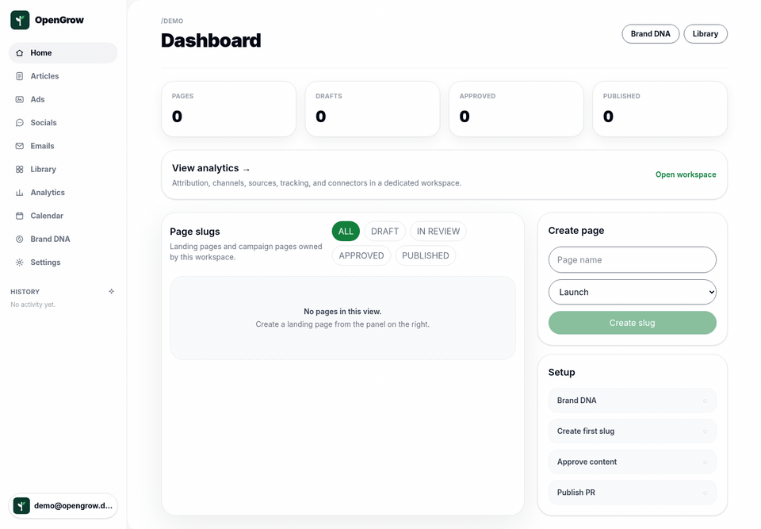

<div align="center">

<picture>
  <source media="(prefers-color-scheme: dark)" srcset="./docs/logo-dark.png">
  
</picture>

# OpenGrow

**Open-source AI marketing autopilot for founders: turn company context into published content, then learn what drives pipeline and revenue.**

Self-host free. Bring your own AI. Publish from GitHub today, more channels tomorrow. Attribute revenue. Own your data.

[](./LICENSE)
[](https://github.com/opengrowhq/opengrow)

[Website](https://opengrow.dev) · [Roadmap](./ROADMAP.md) · [Contributing](./CONTRIBUTING.md) · [Security](./SECURITY.md) · [Commercial](./COMMERCIAL.md)

</div>

---

## Status: Pre-Alpha (v0.3.0)

Full dockerized multi-tenant backend + lite personal-use compose. Backend vertical slice and the Next.js tenant app run locally. The REST API is first-class and documented at `services/fastapi-core/docs/API.md` (live schema at `/docs`).

## See it in action



The loop works locally today: write a brief → approve the outline → generate a
blog-ready Markdown draft → approve it → OpenGrow opens a **GitHub pull
request** in your content repo. A merged PR refreshes back to `PUBLISHED` in
OpenGrow.

Prefer to run it yourself right now? Jump to the [5-minute Quick Start](#quick-start--lite-5-minutes), or follow the full [end-to-end demo walkthrough](./docs/demo-walkthrough.md) using the fixtures in [`examples/`](./examples).

## What works today

The full loop runs locally today — **context → content → publish → attribution**:

**Generate**
- Multi-tenant app (JWT auth, tenant-slug routing) with Brand DNA, Library, calendar, and onboarding under `/app/{slug}/…`
- Brand/context asset upload → async processing (MinIO + Celery + embeddings; Qdrant in production)
- AI generation from a brief, with uploaded assets as context — **bring your own** OpenAI / Anthropic / Google, or run **free & local with Ollama**
- Content lifecycle: draft → review → approve → Markdown export, with status/next-action planning
- Versioned **playbooks** — tenant-customizable system prompts for outline/draft/generic-copy generation, with fallback to a global default (`/playbooks`)

**Orchestrate** — one call runs the whole content cycle end to end (`POST /orchestrator/runs`)
- **Keyword research**: a bare topic gets a real primary/secondary keyword set via no-API-key scraping (Google Autocomplete + Bing SERP/PAA) — skipped automatically if you already supply a keyword
- Outline → optional human-approval pause → draft, brand-conditioned and grounded in your uploaded assets
- **Quality gate**: a draft that scores too low on keyword/heading coverage, length, and readability is regenerated with feedback before it's ever promoted — never silently publishes a weak draft
- Promote → guarded publish, opt-in auto-approve

**Publish**
- **GitHub PR publishing** — the wedge: approve a piece and OpenGrow opens (or reuses) a reviewable pull request on your repo
- More channels (BYOK) via `POST /content/{id}/publish`: WordPress, Ghost, Webflow, Email, X, LinkedIn, Slack
- **Content calendar with scheduled auto-publish**: set a `due_at` + publish target on a piece and an hourly sweep publishes it automatically once it's due and approved

**Attribute**
- First-party tracking pixel + conversion capture (VISIT / SIGNUP / LEAD / CUSTOMER / REVENUE), deduped by `external_id`
- Manual + GA4 / GSC import and connector sync, with per-content / channel / source breakdowns and time-windowed trend deltas
- **Tenant-owned Stripe revenue sync**: connect your own Stripe account (BYOK) and `charge.succeeded` events flow into attribution automatically, tied back to the content that drove them
- Attribution summary tying content → pipeline → revenue
- **Recommendations that close the loop**: a daily sweep flags decaying content to refresh, growing content to double down on, and topic gaps worth writing about (a tag touched by only one published piece), computed from real trend data (`/analytics/recommendations`) — visible in the Analytics dashboard, and one call turns a suggestion into a new orchestrator run

**Platform**
- First-class headless REST API: API keys (`X-API-Key`), `limit/offset` + `X-Total-Count` pagination, `GET /version` — reference in [`docs/API.md`](./services/fastapi-core/docs/API.md)
- MCP server (`/mcp`, 19 tools) so agents (Claude Code, Cursor) can drive OpenGrow directly — content, generations, the full article pipeline (research → outline → approve → draft), analytics connectors, and recommendations, all reusing the same REST logic
- Single-call content cycle (`/orchestrator/runs`), per-tenant usage metering (`/usage`), optional rate limiting
- Lite (personal, 8 services) and Production (multi-tenant, 15 services) from one codebase

## Why OpenGrow exists

Most AI marketing tools stop at drafts, exports, rankings, or scheduled posts. OpenGrow is built to become the self-hostable content growth engine for founders:

```
company context → generated content → publishing channel → traffic → conversion → revenue attribution → better next content
```

This loop is not just a diagram — `POST /analytics/recommendations/{id}/start-run` closes it for real: a recommendation computed from real trend data starts a new orchestrator run.

The first publishing channel is **GitHub PR-based publishing** because technical founders already trust reviewable pull requests for website and docs changes. The second wedge is **revenue attribution** because the product only becomes valuable when it learns which content created signups, pipeline, or revenue.

GitHub PR publishing is not the whole product. It is the first sharp workflow. Later channels can include static-site adapters, WordPress, Ghost, Webflow, newsletters, social posts, API/webhooks, and more. The order is intentional: prove one differentiated workflow first, then broaden distribution without becoming another generic scheduler.

## Choose your deployment

OpenGrow ships in two shapes from the same codebase — pick by use case:

| | **Lite** (personal / single-tenant) | **Production** (multi-tenant) |
|---|---|---|
| Services | 5 | 15 |
| Setup time | ~5 min | ~15 min |
| Min RAM | ~2 GB | ~8 GB |
| Auth | JWT | JWT + OpenFGA ReBAC |
| Secrets | env vars | Infisical |
| AV scanning | skipped (personal upload trust) | ClamAV enforced |
| LLM path | LiteLLM library (in-process) | LiteLLM proxy container |
| Vector search | Postgres JSONB embeddings + local cosine ranking | Qdrant |
| BFF | not needed (direct FastAPI) | Node/Fastify |
| Reverse proxy | not needed | Caddy (auto-TLS in prod) |
| Multi-tenancy | single-tenant | full row-level + ReBAC |
| Best for | solo dev, personal blog automation, quick eval | agency, team, enterprise |

Both modes use the same `services/fastapi-core/app/` code — the `DEPLOYMENT_MODE` env var branches the boot-time behavior. Read [`ASSUMPTIONS.md`](./ASSUMPTIONS.md) for the architectural rationale.

---

## Quick Start — Lite (5 minutes)

Requires Docker Desktop or Docker Engine with Compose v2.

```bash
git clone https://github.com/opengrowhq/opengrow.git
cd opengrow

# Copy env template + set at least one LLM key
cp .env.lite.example .env
$EDITOR .env       # set OPENAI_API_KEY (or use Ollama for free local)

# Start the 8-service stack
make lite-up

# Optional: free local generation + asset retrieval with Ollama
docker compose -f docker-compose.lite.yml exec ollama ollama pull llama3.1
docker compose -f docker-compose.lite.yml exec ollama ollama pull nomic-embed-text

# Migrate + seed a demo user
make lite-migrate
make lite-seed
```

That's it. Open the API docs at `http://127.0.0.1:8000/docs`, or the frontend at `http://127.0.0.1:3000`. Sign in with:
- Email: `demo@opengrow.dev`
- Password: `123456`

Ports (lite):
- `127.0.0.1:3000` — Next.js frontend
- `127.0.0.1:8000` — FastAPI (direct)
- `127.0.0.1:9001` — MinIO console
- `127.0.0.1:8025` — Mailpit (email inspector)

Self-hosting: back up your data (Postgres + MinIO objects) before relying on it — see the [backup & restore guide](./docs/backup-restore.md). For what security guarantees differ from production, see the [lite vs production threat model](./docs/threat-model.md).

Authenticated frontend routes live under the tenant slug:

- `/app/demo` — pages/slugs dashboard
- `/app/demo/brand` — Brand DNA
- `/app/demo/content` — Library
- `/app/demo/content/{id}` — editor
- `/app/demo/calendar` — status/next-action calendar
- `/app/demo/onboarding` — brand onboarding

Legacy protected routes such as `/brand`, `/content`, and `/onboarding` redirect to `/login`; they are not canonical app URLs.

GitHub PR publishing — **full setup guide: [`docs/publishing-github.md`](./docs/publishing-github.md)**:

- Set `GITHUB_TOKEN` in `.env` for lite mode. Use a fine-grained or classic PAT with Contents and Pull requests write access on the target repo.
- Approve a content piece in `/app/demo/content/{id}`.
- Fill `owner/repo`, path, branch, and optional PR details in the GitHub publish panel.
- OpenGrow writes the Markdown file to an `opengrow/{content_id}` branch and opens or reuses a pull request.
- Use **Refresh status** on the publication after the PR is merged; OpenGrow marks the publication and content piece as `PUBLISHED`.

Revenue attribution foundation:

- `POST /analytics/events` imports tenant-scoped outcome events such as `VISIT`, `SIGNUP`, `LEAD`, `CUSTOMER`, and `REVENUE`.
- `GET /analytics/pixel.gif?tenant=demo&content_piece_id={id}` records a first-party `VISIT` and returns a no-cache 1x1 GIF.
- `POST /analytics/track` records first-party `SIGNUP`, `LEAD`, `CUSTOMER`, or `REVENUE` conversion events; `external_id` dedupes repeat conversion posts.
- `GET /analytics/tracking/status` reports whether first-party tracking has been seen for the tenant, with visit/conversion counts and last-seen time.
- `/app/demo` exposes a Tracking panel with workspace/page-specific pixel and signup/lead/customer/revenue conversion snippets plus install status.
- `POST /analytics/import` imports aggregate manual, GA4, or GSC rows, normalizes channel data, and upserts by dedupe key so repeated imports do not double-count.
- `GET/POST /analytics/connectors` stores tenant-scoped GA4/GSC connector setup records.
- `GET /analytics/connectors/google/auth-url?provider=ga4|gsc` returns a Google OAuth URL when `GOOGLE_OAUTH_CLIENT_ID` and `GOOGLE_OAUTH_REDIRECT_URI` are configured.
- `POST /analytics/connectors/{id}/google/callback` exchanges an OAuth code, stores connector credentials internally, and redacts credentials from API responses.
- `POST /analytics/connectors/{id}/sync` queues a connector sync attempt. Connected GSC connectors fetch Search Analytics rows by page; connected GA4 connectors fetch Data API landing-page rows. Both refresh Google access tokens when possible and map into deduped attribution events.
- Celery beat runs a daily connector sync enqueue job at 04:00 UTC.
- Events can be linked to a `content_piece_id`.
- `GET /analytics/summary` returns counts and attributed revenue for the tenant or one content piece.
- `GET /analytics/content` ranks content by revenue, customers, leads, and events.
- `GET /analytics/channels` summarizes attributed outcomes by normalized channel.
- `GET /analytics/sources` summarizes attributed outcomes by source URL.
- `GET /analytics/trends?days=30` returns the current attribution summary, previous same-length window, and metric deltas.
- `GET /analytics/channel-trends?days=30` returns current/previous summaries and deltas per channel.
- `GET /analytics/source-trends?days=30` and `GET /analytics/content-trends?days=30` return current/previous summaries and deltas for sources and content.
- Attribution read endpoints accept `?days=7|30|90|365` for time-windowed executive views; omit it for all-time data.

Quick vertical slice curl:

For the local Ollama path, pull both `llama3.1` and `nomic-embed-text` first.
Uploaded text assets move through `UPLOADED → EMBEDDING → INDEXED`; article
generations then retrieve the most relevant indexed asset snippets as grounding
context.

```bash
GW=http://127.0.0.1:8000
TOKEN=$(curl -sf -X POST $GW/auth/login \
  -H "Content-Type: application/x-www-form-urlencoded" \
  --data-urlencode "username=demo@opengrow.dev" \
  --data-urlencode "password=123456" \
  | jq -r .access_token)

cat > brand.txt <<'TXT'
OpenGrow brand voice: direct, no jargon, technical.
Specifics to use: GitHub PR review before publishing, local-first workflow,
and revenue attribution from article to lead to customer.
TXT
UPLOAD=$(curl -sf -X POST $GW/assets/upload \
  -H "Authorization: Bearer $TOKEN" \
  -F "file=@brand.txt;type=text/plain")
ASSET_ID=$(echo $UPLOAD | jq -r .asset_id)

# Wait for INDEXED before article generation can use the asset as grounding
while true; do
  STATUS=$(curl -sf -H "Authorization: Bearer $TOKEN" $GW/assets/$ASSET_ID | jq -r .status)
  [ "$STATUS" = "INDEXED" ] && break; sleep 2
done

GEN=$(curl -sf -X POST $GW/generations \
  -H "Authorization: Bearer $TOKEN" -H "Content-Type: application/json" \
  -d '{
    "brief": "Plan an article about OpenGrow for technical founders",
    "model": "ollama/llama3.1",
    "metadata": {
      "kind": "article_outline",
      "article": {
        "topic": "OpenGrow for technical founders",
        "primary_keyword": "founder blogging workflow",
        "secondary_keywords": ["GitHub PR publishing", "content attribution"],
        "audience": "technical founders",
        "goal": "educate",
        "tone": "direct, concrete, no hype",
        "length_words": 900,
        "sections_target": 4,
        "notes": "Use concrete workflow details from reference material."
      }
    }
  }')
GEN_ID=$(echo $GEN | jq -r .id)

while true; do
  R=$(curl -sf -H "Authorization: Bearer $TOKEN" $GW/generations/$GEN_ID)
  [ "$(echo $R | jq -r .status)" = "COMPLETE" ] && echo $R | jq .result && break
  sleep 2
done
```

---

## Quick Start — Production (15 minutes)

For multi-tenant deployments (agencies, teams, enterprise).

```bash
# 1. Bootstrap secrets, dep containers, print the checklist
make bootstrap

# 2. Manual UI steps (bootstrap.sh prints them):
#    - Infisical UI (http://127.0.0.1:8090): create project, add secrets, mint token
#    - OpenFGA playground (http://127.0.0.1:3000): paste model.fga, copy store/model IDs

# 3. Start full stack
make up-d

# 4. Migrate + seed + verify
make migrate
make seed
make test-e2e
```

Ports (production dev): `3001` (BFF), `8000` (core), `9001` (MinIO), `5555` (Flower), `8025` (Mailpit), `8090` (Infisical), `3000` (OpenFGA).

For a Debian single-server prod deploy: `make prod-up` after setting `CADDY_DOMAIN` + `CADDY_EMAIL` in `.env`.

---

## Repository layout

```
opengrow/
├── docker-compose.lite.yml           # Lite (8 services) — personal use
├── docker-compose.yml                # Base (15 services) — production
├── docker-compose.prod.yml           # Debian single-server overlay
├── Makefile                          # make lite-up / make up-d / make prod-up
├── .env.lite.example                 # Env template for lite
├── .env.example                      # Env template for production (Infisical)
├── ASSUMPTIONS.md                    # Every architectural decision
├── AGENTS.md                         # Source of truth for AI agents
├── LICENSE                           # AGPL v3
├── NOTICE                            # Commercial license option
├── services/
│   ├── fastapi-core/                 # Python 3.12 + FastAPI + Celery
│   ├── frontend/                     # Next.js App Router frontend
│   └── node-gateway/                 # Node 22 + Fastify (production only)
├── infra/
│   ├── caddy/
│   ├── litellm/
│   ├── openfga/
│   └── scripts/{bootstrap,backup,restore}.sh
└── tests/e2e/vertical_slice.sh
```

## Key differences: Lite vs Production

The **same code** in `services/fastapi-core/app/` runs in both modes. The `DEPLOYMENT_MODE` env var (set to `lite` or `production` in the respective compose files) switches:

| File | Lite behavior | Production behavior |
|---|---|---|
| `app/config.py` | Reads all secrets from env vars | Fetches from Infisical at boot |
| `app/core/authz.py` | Stub client: `check(...) → True` | Real OpenFGA `check` calls |
| `app/core/clamav.py` | `scan_bytes → (True, "skipped-lite-mode")` | Real clamd network scan |
| `app/core/litellm_client.py` | Calls `litellm.acompletion()` in-process | HTTP call to LiteLLM proxy |
| `app/core/retrieval.py` / `app/core/qdrant.py` | Stores asset embeddings in Postgres JSONB and ranks locally by cosine similarity | Qdrant collection upsert + vector search |
| `app/routers/health.py` | `/ready` checks postgres + minio | Also checks Qdrant, OpenFGA, LiteLLM |

Tenant isolation via row-level `tenant_id` filters is enforced in **both** modes at the SQL layer. Lite mode drops only the ReBAC (OpenFGA) enforcement.

## Documentation

| Doc | What's inside |
|---|---|
| [services/fastapi-core/docs/API.md](./services/fastapi-core/docs/API.md) | REST API reference — auth, API keys, pagination, errors, endpoint groups (live schema at `/docs`) |
| [AGENTS.md](./AGENTS.md) | Source of truth for AI agents contributing to the code — patterns, conventions, invariants |
| [ASSUMPTIONS.md](./ASSUMPTIONS.md) | Architectural Decision Record — every accept/reject with rationale |
| [ROADMAP.md](./ROADMAP.md) | Product sequence and business-impact priorities |
| [CHANGELOG.md](./CHANGELOG.md) | What's shipped per release (Keep a Changelog format) |
| [docs/publishing-github.md](./docs/publishing-github.md) | GitHub PR publishing — token setup, publish flow, troubleshooting |
| [docs/demo-walkthrough.md](./docs/demo-walkthrough.md) | End-to-end demo: brand upload → generate → GitHub PR → attribution, using `examples/` fixtures |
| [docs/upload-pipeline.md](./docs/upload-pipeline.md) | Asset lifecycle (UPLOADED → SCANNING → SCANNED → EMBEDDING → INDEXED) for operators/reviewers |
| [docs/model-provider-data-flow.md](./docs/model-provider-data-flow.md) | Where prompts/content flow (LiteLLM routing, BYOK vs local Ollama, what leaves the host) |
| [docs/threat-model.md](./docs/threat-model.md) | Lite vs production security guarantees and what lite mode is not safe for |
| [docs/backup-restore.md](./docs/backup-restore.md) | Backup/restore for operators — Postgres, MinIO object storage, lite vs production |
| [CONTRIBUTING.md](./CONTRIBUTING.md) | Local setup, contribution rules, PR checklist |
| [SECURITY.md](./SECURITY.md) | Security posture, reporting, lite vs production trust boundary |
| [COMMERCIAL.md](./COMMERCIAL.md) | Commercial license, support path |

## Testing rule

Every new or changed functionality must include focused tests in the same change. Use the closest useful layer when a full browser/e2e harness does not exist yet, and call out any remaining gap.

## License

- **Code**: [GNU Affero General Public License v3](./LICENSE)
- **Commercial option**: For enterprises whose legal teams cannot accept AGPL — open a [GitHub Discussion](https://github.com/opengrowhq/opengrow/discussions) per [NOTICE](./NOTICE)

---

<div align="center">

**Star the repo** ⭐ to follow along.

[opengrow.dev](https://opengrow.dev) · Built by [@akfullstack](https://x.com/akfullstack)

</div>
